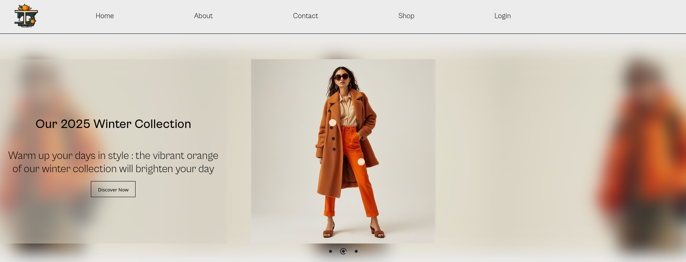

# About the project

This project **complements the project named ‘tailor-pulp-e-commerce-web-app’** published on Github.

For context, like the original project, this project features a **completely fictional company** named Tailor'Pulp, created for **illustrative purposes**.
**All company names, brands, products, employees, or locations mentioned** in the code, frontend are **fictitious**.

Any resemblance to a real company, whether existing or defunct, is **purely coincidental**.
These references **do not imply any affiliation** with or endorsement by any real entity.

**The project is an e-commerce web application** with :

- Tomcat server back-end (Spring Boot) (Dockerfile)
- React front-end (Dockerfile)
- db : init.sql file for PostgreSQL database
- docker-compose.yml at the root to orchestrate services

The **App set up** section details all the steps to set up and launch the web application with Docker



# App set up

## 1. Prerequisites

### Requirements

#### Stripe

Have a Stripe account in developer mode with API keys associated with the **test environment** specifically :

Secret Stripe key format : `sk_test_...`
Public Stripe key format : `pk_test_...`

Use the **test card numbers** provided by Stripe for fake transactions. More information on https://docs.stripe.com/

#### Google 

Have generated an ID for Google OAuth2.0
Have generated the secret key for reCAPTCHA

More information on https://console.cloud.google.com/

#### SMTP

Have generated an App Password for Google SMTP (optional if another SMTP service is selected)

## 2. Set up the repository

```bash
git clone https://github.com/alextechbuild/tailor-pulp-e-commerce-web-app-sb-jv.git
```

Navigate to the repository

```bash
cd your_repository
```

## 3. Set up the environment variables

Create .env file and application.properties

### For the back-end (./back-end/src/main/resources/application.properties)

Create application.properties and add the following environment variables (the values should be adapted according to your API keys for the different services) :


```application.properties

# --- Back-end ---


spring.application.name=tailor_pulp_website


# --- Configuration HTTPS ---


server.ssl.enabled=true
server.ssl.key-store=classpath:certs/keystore.p12
server.ssl.key-store-type=PKCS12
server.ssl.key-store-password=myPassword
server.ssl.key-alias=1


# --- Back-end port ---
server.port=4000

# --- URL ---
front.end.url=https://localhost:3000

# --- Cron (leader variable on this specific instance only (mettre false sur tout le reste des .env)) ---
is.leader=true

# --- Newsletter ---
newsletter.path=../newsletter/newsletter.pdf


# --- SMTP ---


spring.mail.host=smtp.gmail.com
spring.mail.port=587
# Gmail SMTP needs auth
spring.mail.properties.mail.smtp.auth=true
# Protocol used by Gmail SMTP
spring.mail.properties.mail.smtp.starttls.enable=true
assistance.email=tailorpulpassistance@example.com


# --- PostgreSQL ---


# --- Db host (dev mode : complete with 'localhost' for dev mode, otherwise complete with db service name for Docker (postgres_db by default))
spring.datasource.url=jdbc:postgresql://postgres_db:5432/tailor_pulp_db
spring.datasource.driver-class-name=org.postgresql.Driver

# Connexion Pool (HikariCP)
spring.datasource.hikari.maximum-pool-size=10
spring.datasource.hikari.minimum-idle=2
spring.datasource.hikari.idle-timeout=30000
spring.datasource.hikari.pool-name=HikariCP


# --------------------------- TO BE COMPLETED ---------------------------


# --- PostgreSQL ---
spring.datasource.username=
spring.datasource.password=

# --- SMTP ---
host.email=
spring.mail.username=
spring.mail.password=

# --- Google Login ---
google.oauth.client.id=

# --- Stripe ---
stripe.secret.key=

# --- Cookies ---
cookie.secret=

# --- Google ---
recaptcha.secret.key=


# --- Keys ---

# PKCS#8 Format
private.key=

# X.509 Format
public.key=


# --- JWT ---
jwt.secret=

```

### For the front-end (./front-end/.env)

Create .env file and add the following environment variables (the values should be adapted according to your API keys for the different services) :

```.env

# --- HTTPS ---
VITE_HTTPS="true"

# --- Front-end port ---
PORT="3000"

# --- Back-end URL ---
VITE_BACKEND_URL="https://localhost:4000"


# --------------------------- TO BE COMPLETED ---------------------------


# --- Google OAuth2.0 Client ID ---
VITE_GOOGLE_OAUTH_CLIENT_ID=""

# --- Google reCAPTCHA ---
VITE_RECAPTCHA_WEBSITE_KEY=""

```

## 4. Generate the TLS/SSL certificates

### 1. Install mkcert

```bash
sudo apt install libnss3-tools
wget -O mkcert https://github.com/FiloSottile/mkcert/releases/latest/download/mkcert-v1.4.4-linux-amd64
chmod +x mkcert
sudo mv mkcert /usr/local/bin/
```

### 2. Generate root certificate

```bash
mkcert -install
```

### 3. Generate TLS/SSL certificates for localhost

In **'./certs/'** folder :

```bash
mkdir certs
cd certs
mkcert localhost 127.0.0.1 ::1
```

2 files will be generated :

localhost+2.pem
localhost+2-key.pem

### 4. Generate keystore.p12 for Spring Boot

```bash
openssl pkcs12 -export \
  -in localhost.pem \
  -inkey localhost-key.pem \
  -out keystore.p12 \
  -name "localhost"
```

Then, move keystore.p12 file in **'./back-end/src/main/resources/certs'** folder (create one if needed)

## 5. Create the database (postgreSQL)

### 1. Configure postgreSQL

#### 1. Install postgreSQL

```bash
sudo apt update -y
sudo apt upgrade -y
sudo apt install postgresql postgresql-contrib
```

#### 2. Check if postgreSQL is correctly installed

```bash
sudo systemctl status postgresql
```

Otherwise, for launching and activating postgreSQL on boot :

```bash
sudo systemctl start postgresql
sudo systemctl enabled postgresql
```

#### 3. Switch to the postgreSQL system user (default)

```bash
sudo -i -u postgres
```

#### 4. Access to postgresql

```bash
psql
```

#### 5. Create a new user

```sql
CREATE USER nickname WITH PASSWORD 'your_password';
```

#### 6. Grant privileges + create DATABASE

```sql
ALTER USER nickname CREATEDB;
CREATE DATABASE tailor_pulp_db WITH OWNER nickname;
\q
```

### 2. Launch database

#### Launch database for the first time

```sql
psql -h localhost -U nickname -d tailor_pulp_db -W;
```

Then copy paste init.sql

#### Re-launch database for next times

```sql
psql -h localhost -U nickname -d tailor_pulp_db -W;
```

## 6. Building Package

In ./back-end, you can build the application as a .jar file :

```bash
mvn package
```

## 7. Containerise the app with Docker (dev mode)

### 1. Install Docker

#### 1. Add the official Docker repository

```bash
sudo apt update -y
sudo apt upgrade -y
curl -fsSL https://download.docker.com/linux/ubuntu/gpg | sudo apt-key add -
sudo add-apt-repository "deb [arch=amd64] https://download.docker.com/linux/ubuntu $(lsb_release -cs) stable"
```

#### 2. Install Docker

```bash
sudo apt-get install docker-ce docker-ce-cli containerd.io -y
```

#### 3. Check if Docker is correctly installed

```bash
sudo docker --version
```

#### 4. Launch and activate Docker on boot

```bash
sudo systemctl start docker
sudo systemctl enable docker
```

#### 5. Check Docker installation

```bash
sudo docker run hello-world
```

#### 6. Using Docker without sudo (optional)

```bash
sudo usermod -aG docker $USER
```

### 2. Run the app

#### Build and run the app for the first time

```bash
docker-compose up --build
```

#### Re-run the app for next times

```bash
docker-compose up
```

#### Launch the app with web browser

In a web browser, type https://localhost:3000

# About images

This project uses **images** generated by artificial intelligence for **illustrative** purposes

## Tool used

- Tool : [Perchance](https://perchance.org/)
- Purpose : illustrative visuals for the front-end

## Terms of use

- No image depicts a real or identifiable person
- The images were generated solely for artistic and non-commercial purposes
- The prompts used comply with the ethical rules and terms of use of the Perchance platform

## Licence and attribution

- Images generated via Perchance may be used freely within the scope of this project
- Their use remains subject to the Perchance Terms of Use
- Please mention Perchance as the source if you reuse these visuals in another public context

# About the font used

For licence compatibility reasons, **the original font used in the design of the site (CabinetGrotesk) is not included in this MIT version**.

All CSS declarations of the type :

```css
font-family: 'CabinetGrotesk-Variable', ...;
```

have been replaced by :

```css
font-family: Arial, Helvetica, sans-serif;
```

The screenshots shown in the repository use the original font solely for visual purposes only.
If you wish to find or use this font, you can download or embed it for free from [FontShare](https://www.fontshare.com/fonts/cabinet-grotesk).

# If you like this project, please consider supporting its development:

- ⭐️ By leaving a **star** on this GitHub repository
- 📢 By **sharing** this project with your **network**
- 📝 By leaving **feedback**
